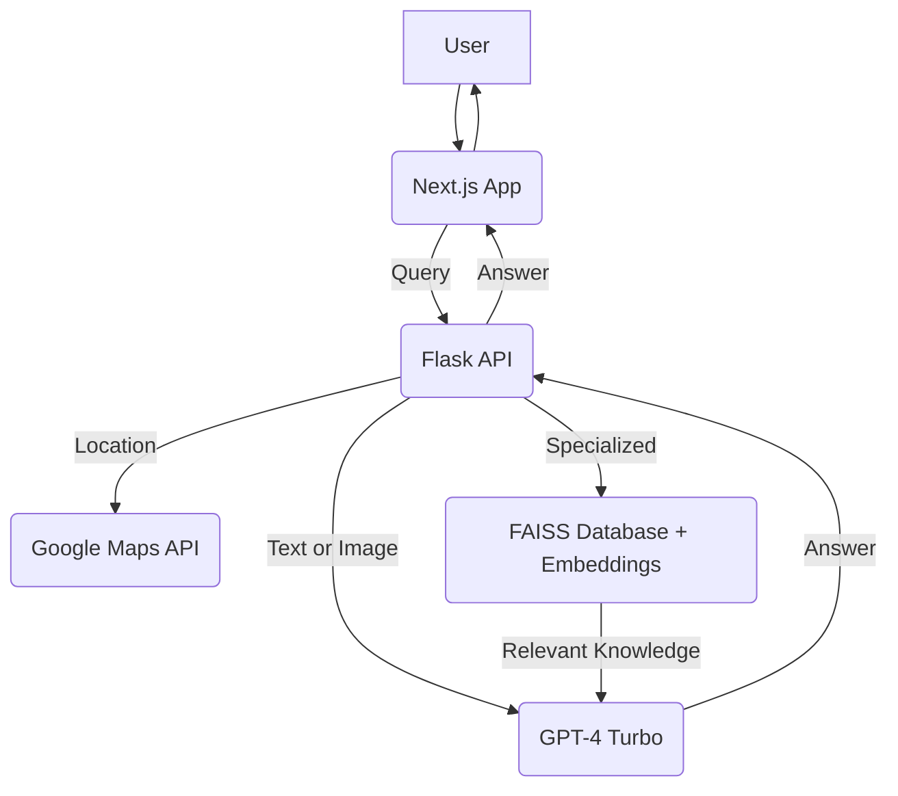

Of course! Here's the **full README** formatted with `#` for Markdown, ready for you to **copy-paste** directly into your `README.md` file:

---

# 🩺 Saht-ino: Your AI Health Companion

---

# Project Overview

**Saht-ino** is an innovative AI-based healthcare platform offering **two core solutions**:

## 1. 👨‍⚕️ Doctor Support Assistant

We empower doctors to have their **own specialized AI assistant**, which:

- Is trained on the **doctor's personal knowledge and expertise**.
- Acts as a **consultation partner** for patients, available **24/7** via smartphone.
- **Patients pay** for access to personalized, expert-driven assistance based on the doctor's specialty.
- **Example:** We have developed a **Diabetes Care Assistant** as a first MVP.
- **Technology:** RAG system (Retrieval-Augmented Generation) using doctors' own resources.

> Doctors can offer their AI as a premium service to patients.

## 2. 📱 Public AI Health Assistant (for users)

A **general-use healthcare AI assistant** that provides:

- 🖼️ **Image Analysis**: Analyze skin conditions, wounds, etc., from images.
- 💊 **Medication Suggestion & Diagnosis**: Get advice based on written symptoms (with a disclaimer).
- 🧭 **Specialist Guidance**: Suggest which type of doctor you should visit based on your symptoms.
- 🏥 **Nearby Hospital Finder**: Suggest nearby hospitals/clinics based on user's location.

🔹 **Goal**: Bring healthcare guidance to people’s pockets, improving accessibility and awareness.

---

# 🛠️ Key Components and Architecture

| Component                           | Description                                                          |
| :---------------------------------- | :------------------------------------------------------------------- |
| **Flask API**                       | Manages backend logic and AI processing                              |
| **LangChain (RAG)**                 | Retrieval and Augmented Generation system for specialized assistants |
| **FAISS**                           | Fast document search through vector embedding                        |
| **OpenAI Embeddings & GPT-4 Turbo** | Foundation for NLP, question answering, and content generation       |
| **Deep Translator**                 | Enable Arabic/English language support                               |
| **Next.js Frontend**                | Beautiful and dynamic web interface                                  |
| **External APIs**                   | For hospital location search (e.g., Google Maps API)                 |

---

## 2. Install backend dependencies

```bash
cd backend
pip install -r requirements.txt
```

## 3. Set environment variables

Create a `.env` file in the backend root with:

```
OPENAI_API_KEY=your_openai_api_key
DEEPL_API_KEY=your_deepL_api_key (optional)
GOOGLE_MAPS_API_KEY=your_google_maps_api_key
```

## 4. Start the backend

```bash
python app.py
```

# 🧠 System Architecture



Step 3: Install Dependencies
Make sure to install all the required dependencies from requirements.txt:

```bash
pip install -r requirements.txt
```

Step 4: Run the Python Scripts
Run the store_index.py script to initialize the necessary index:

```bash
python store_index.py
```

Now you can run the main app and RAG scripts:

```bash
To run app.py:
```

```bash
python app.py
```

To run RAG.py:

```bash

python RAG.py
```

Step 5: Access the Application

# 📄 License

This project is under the **MIT License**.
Feel free to contribute, fork, and innovate!

---

# 🩺 Saht-ino

**"Your Health, Always Within Reach"**

---
